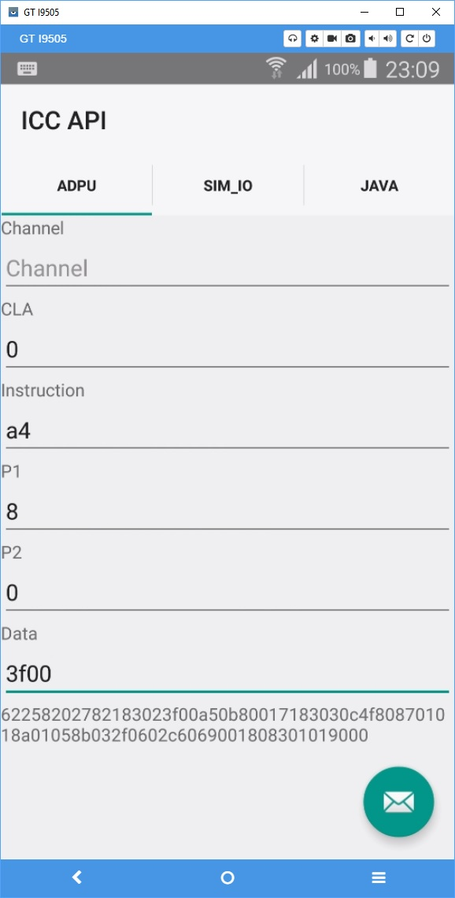

Android ICC Tool
===================================

This app allows you to test Android Lollipop TelephonyManager ICC functions

Introduction
------------

1. With the "BASIC" Tab you can test the [iccTransmitApduBasicChannel][1] function
2. With the "SIM_IO" Tab you can test the [iccExchangeSimIO][2] function

[1]: https://developer.android.com/reference/android/telephony/TelephonyManager.html#iccTransmitApduBasicChannel(int,%20int,%20int,%20int,%20int,%20java.lang.String)
[2]: https://developer.android.com/reference/android/telephony/TelephonyManager.html#iccExchangeSimIO(int,%20int,%20int,%20int,%20int,%20java.lang.String)

Pre-requisites
--------------

- Android SDK 26
- Android Build Tools v27.0.2
- Android Support Repository

Installation
-------------
For now the app must be installed as a privileged app, After building the release version (Build->Generate Signed APK...)
run these commands at a command prompt:

`adb remount`  
`adb push Application-release.apk /system/priv-app/telephonytest.apk`  
`adb reboot`  

Screenshots
-------------

  

License
-------

Copyright 2017 SURFnet

Licensed to the Apache Software Foundation (ASF) under one or more contributor
license agreements.  See the NOTICE file distributed with this work for
additional information regarding copyright ownership.  The ASF licenses this
file to you under the Apache License, Version 2.0 (the "License"); you may not
use this file except in compliance with the License.  You may obtain a copy of
the License at

http://www.apache.org/licenses/LICENSE-2.0

Unless required by applicable law or agreed to in writing, software
distributed under the License is distributed on an "AS IS" BASIS, WITHOUT
WARRANTIES OR CONDITIONS OF ANY KIND, either express or implied.  See the
License for the specific language governing permissions and limitations under
the License.
